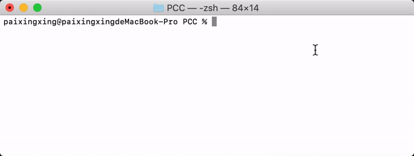
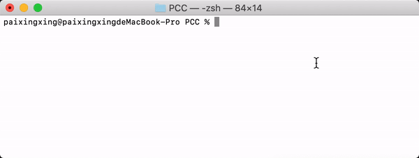

<p align="center">
  <h3 align="center">PCC x64</h3>
  <p align="center">
    A Python-based Clanguage Compiler on Maxos x64.
  </p>
  <p align="center">
    
    <a href="http://opensource.org/licenses/MIT"></a>
    
    
  </p>
</p>

## Introduction

The PCC x64 compiler implements a subset programming language of  the C language. It utilizes the "variables as pointers" feature of python when building the PCC AST (abstract syntax tree) and the "runtime caller's stack" to generate compile-time messages. Such practices make the PCC's code neat, robust and highly extensible.

## Demos

### Hello, world!



### Hanio


### Pi


## Features
* **Modularization**: The PCC is divided into tokenizer, preprocessing unit, AST generator, ASM generator and the variable manager.
* **Support Up to 30 Operators**: Including assignment operators, such as =, \*=, >>=, unary operators, such as ++, !, ~, binary operators, such as +, \*, %, relation operators, such as &&, ||, address operators, such as * and &, condition operator condition?if_statement:else_statement.
* **Scalar and Vector Support**
* **Support SystemCall**: E.g., PCC supports the program calling a std function with a non-struct return value.
* **Clear Error Message**: PCC  uses "runtime caller's stack" to generate compile-time messages.
* **Neat AST Module**: PCC  uses utilizes the "variables as pointers" feature of python when building the PCC AST (abstract syntax tree).

## Usage

### Open GUI
```bash
python3 gui.py
```

#### Open WebUI
```bash
python3 webgui.py
```

then open http://127.0.0.1:5001/ in your webrowser.

## About

This software (PCC x64) is an coursework for "Compileation" and the instructor is Weighing, Yao.

```
Author: Chengxuan Ying(@chengsyuan)
Last Update: 12.7.2019
```
